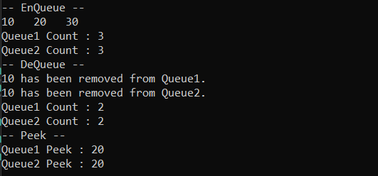

# Advanced Data Structures with C#

## Data Structures
System.Collections      IEnumerable
- ArrayList, Hashtable, Queue, Stack

System.Collections.Generic      IEnumerable<-T->    |   foreach - LINQ
- Dictionary<-TKey, TValue->, List<-T->, Queue<-T->
- SortedList<-TKey, TValue->, Stack<-T->
- SortedSet<-TKey, TValue->, HashSet<-TKey, TValue->

## [Arrays](https://github.com/AtakanTurgut/DataStructures_Advanced/blob/main/arrays/arrays/Program.cs) 
Array   |   Dizi -> Arrays are of reference type. - Linear  <br />
Zero-based indexing - Fixed sized <br />
One block allocation and Complex position-based insertion <br />
Single-dimension | Multi-dimension  <br />
Basic and Direct Access O(1) <br />

## [ArrayLists()](https://github.com/AtakanTurgut/DataStructures_Advanced/blob/main/arrays/arrays/Program.cs) 
ArrayList   |   non-generic = boxing -> object  |  object -> unboxing - Linear <br />
Dynamically sized   |   Type non-safety
.Add()  .Remove()   .Insert()

## [Lists<-T->](https://github.com/AtakanTurgut/DataStructures_Advanced/blob/main/arrays/arrays/Program.cs)
List<-T->   |       Type Safety  -> generic - Linear    <br />
Interface -> Inheritance : Inherits contracts.  <br />

## [Arrays<-T->](https://github.com/AtakanTurgut/DataStructures_Advanced/blob/main/arrays/arrays/Array.cs)
Array<-T->   |       Type Safety  -> generic - Linear   <br />
Implement IEnumerable<-T->  <br />


## [LinkedLists<-T->](https://github.com/AtakanTurgut/DataStructures_Advanced/blob/main/linkedlists/linkedlists/Program.cs) 
LinkedList<-T->  |  Bağlı Liste           Type Safety  -> generic - Linear  <br />
Abstract Data Type  <br />
It can be bidirectional or unidirectional, linear data structure.  <br />
Expandable O(1) and non-preallocated.    <br />
Access Time O(n).    <br />
.AddFirst()      .AddLast()      .First()    .Last()     .AddBefore()    .AddAfter()    <br />

        Node   ==   - | data | pointer 
        <- | previous | data | next | ->
               firstNode ... lastNode

### [SinglyLinkedList<-T->](https://github.com/AtakanTurgut/DataStructures_Advanced/blob/main/linkedlists/linkedlists/SinglyLinkedList/SinglyLinkedList.cs)   
SinglyLinkedList<-T->   |   Tek Yönlü Bağlı Liste  
First Node = Head   |   Last Node = Tail -> NULL

        Node == value | pointer = default NULL     
                value | next | ->

.Insert()   .Delete()   -   .DeleteList()   .Count()    .Find()

- Language Integrated Query - LINQ
- Inserting at the beginning (Head) O(1).
- Inserting at the ending (Tail ->  NULL) O(n).
- Inserting at the middle O(n).
- Traversing the list O(n).
- Deleting first node in the singly linked list O(1).
- Deleting last node in the singly linked list O(n).
- Deleting an intermediate node in the singly linked list O(n).


### [DoublyLinkedList<-T->](https://github.com/AtakanTurgut/DataStructures_Advanced/blob/main/linkedlists/linkedlists/DoublyLinkedList/DoublyLinkedList.cs)   
DoublyLinkedList<-T->   |   Çift Yönlü Bağlı Liste  
First Node = Head   |   Last Node = Tail -> NULL

        Node   ==   - | value | pointer = default NULL     
        <- | previous | value | next | ->

.Insert()   .Delete()   -   .DeleteList()   .Count()    .Find()

- Inserting at the beginning (Head) O(1).
- Inserting at the ending (Tail ->  NULL) O(1).
- Inserting at the given position O(n).
- Traversing the list O(n).
- Deleting at the first node O(1).
- Deleting at the last node O(1).
- Deleting an intermediate node in the doubly linked list O(n).


## [Stacks<-T->](https://github.com/AtakanTurgut/DataStructures_Advanced/blob/main/stacks/stacks/Stack.cs) 
Stack<-T->  |  Yığın           Type Safety  -> generic - Linear     <br />
Array and ArrayList are used to organize data.  <br />
Only the last elements of the stacks can be accessed.   <br />
Last-in First-out     ->  LIFO  |  First-in Last-out     ->  FILO    <br />
.push() -> Ekleme          .pop() -> Çıkarma        .Clear() -> Yığını boşaltma        .ToArray() -> int[]     <br />

```cs
        in-fix   ->  3 + 5 => 8
        post-fix ->  3 5 + => 8         operants => 2 * .pop() from stack.

                  2 3 1 * + 9 -      result=?
        stack ->  2 3 1 *
                        .pop() - s1 -> 1      s2 * s1
                        .pop() - s2 -> 3      3 * 1 => 3 -> .push() to stack.
        
        stack ->  2 3 +
                      .pop() - s1 -> 3        s2 + s1
                      .pop() - s2 -> 2        2 + 3 => 5 -> .push() to stack.
        
        stack ->  5 9 -
                      .pop() - s1 -> 9        s2 - s1
                      .pop() - s2 -> 5        5 - 9 => -4 -> .push() to stack.
        
        result ->  -4
 ```


## [Trees<-T->](https://github.com/AtakanTurgut/DataStructures_Advanced/blob/main/trees/trees/Program.cs) 
Tree<-T->  |   Ağaç         - Nonlinear <br />
Root Node Leaf  <br />
Child Parent Siblings Edge      <br />
Level -> zero start (Root) + Edge       <br />
High Level ==> Tree Height = max single branch edges.    <br />
Left Subtree (smaller than Root) | Right Subtree (larger than Root)    <br />

        Max Tree Node = 2^(h+1)-1 

### [Traveling on the Tree](/#)

```cs
            1
          /   \              PreOrder  : Data Left Right     - O(n)    1 2 4 5 3 6 7
        2       3            InOrder   : Left Data Right     - O(n)    4 2 5 1 6 3 7
       /  \    /  \          PostOrder : Left Right Data     - O(n)    4 5 2 6 7 3 1   
      4    5  6    7         LevelOrder: Root > Nodes > Leafs - L>R    1 2 3 4 5 6 7
     ||    || ||   ||
     n     n   n    n
```

#### Skew Trees
- Skew Tree : Just one child from the Nodes.
- Left Skew Tree 
- Right Skew Tree

## [BinarySearchTrees<-T->](https://github.com/AtakanTurgut/DataStructures_Advanced/blob/main/trees/trees/BinarySearchTree/BinarySearchTree.cs) && [BinaryTrees<-T->](https://github.com/AtakanTurgut/DataStructures_Advanced/blob/main/trees/trees/BinaryTree/BinaryTree.cs) 

- The left is followed continuously for the smallest value. O(log(n)) (BST)     <br />
- The right is followed continuously for the greater value. O(log(n)) (BST)     <br />
- Find Value.    O(log(n)) (BST)    <br />
- Remove Value.  O(log(n)) (BST)    <br />


- Strict Binary Tree : No child or two children.

```cs
            1
          /   \
        2       3
              /   \
             6     7
```

- Full Binary Tree : Two children from the Nodes.

```cs
            1
          /   \
        2       3
       /  \    /  \
      4    5  6    7
```

- Complete Binary Tree : Start from the Left Leaf. L>R

```cs
            1                     1
          /   \                 /   \
        2       3     =>      2       3
       /                     /  \    /   
      4                     4    5  6   
```

- Left Subtree (smaller than Root) | Right Subtree (larger than Root)     <br />
-- Left to Right for Add.    <br />

```cs
            23                  
          /   \                 PreOrder   DLR : 23 16 3 22 45 37 99
        16      45              InOrder    LDR : 3 16 22 23 37 45 99
       /  \    /  \             PostOrder  LRD : 3 22 16 37 99 45 23
      3   22  37  99            LevelOrder L>R : 23 16 45 3 22 37 99
      n    n  n    n
```

-  After the Root is deleted, the New Root is selected greater from the left or smaller from the right.     <br />


## [Queues<-T->](https://github.com/AtakanTurgut/DataStructures_Advanced/blob/main/queues/queues/Queue.cs) 
Queue<-T->  |   Kuyruk         Type Safety  -> generic - Linear  <br />
First-in First-out    ->  FIFO   |  Last-in Last-out    ->  LILO     |    Abstract Data Type   <br />
.Enqueue() -> Ekleme       .Dequeue() -> Çıkarma    <br />
 <br />
The Operating System is used to set operating priorities.   <br />
    -> İşletim sistemlerinde çalışma önceliğini belirlemede kullanılır.   <br />



## [Priority Queue](/#) && [Heaps<-T->](https://github.com/AtakanTurgut/DataStructures_Advanced/blob/main/heaps/heaps/BHeap.cs)
Priority Queue | Öncelikli Kuyruk <br/>
Heap<-T-> | Yığın       Type Safety  -> generic <br/>
Quick Add and Quick Remove <br/>
.Insert() .DeleteMin() .DeleteMax() <br/>
.Enqueue() -> Ekleme O(1)      .Dequeue() -> Çıkarma O(n)    <br />

- The Parent will be smaller than the Children for `Min-Heap`.
- The Parent will be older than the Children for `Max-Heap`.

Indexing for zero-based:     - C# -
```cs
   Left Index   = parent.index * 2 + 1;      5 * 2 + 1 = 11;
   Right Index  = parent.index * 2 + 2;      5 * 2 + 2 = 12;
   Parent Index = (child.indexes - 1) / 2;   (11 - 1) / 2 = 5, (12 - 1) / 2 = 5;
```
Indexing for one-based:
```cs
   Left Index   = parent.index * 2;        6 * 2 = 12;
   Right Index  = parent.index * 2 + 1;    6 * 2 + 1 = 13;
   Parent Index = child.indexes / 2;       12 / 2 = 6, 13 / 2 = 6;
```
```cs
     Min-Heap       |      Max-Heap  
    
         1                     7
       /   \                 /   \
      5     2               5     6
     /  \  /  \            /  \  /  \
    6   7  4   3          1   4  2   3

i: 0 1 2 3 4 5 6    |    0 1 2 3 4 5 6    zero-based index
v: 1 5 2 6 7 4 3    |    7 5 6 1 4 2 3    LevelOrder  L>R
```

- Sorting an array using heap sort algorithm 
- Implementing priority queues 
- Data Compression: Huffman Coding Algorithm
- Shortest Path Algorithms Dijkstra's Algorithm
- Minimum Spanning Tree Algorithm: Prim's Algorithm
- Event-driven Simulation: customers in a line
- Selection problem: Finding kth-smallest element
- Run multiple programs in the operating system
- Select print jons in order of decreasing length
- Greedy Algorithms

### [Min-Heap](https://github.com/AtakanTurgut/DataStructures_Advanced/blob/main/heaps/heaps/MinHeap.cs)


### [Max-Heap](https://github.com/AtakanTurgut/DataStructures_Advanced/blob/main/heaps/heaps/MaxHeap.cs)


### Heapifying
 The downward movement is called `Percolate down` from the Heapifying.    <br />
 The upward movement is called `Percolate up` from the Heapifying.    <br />

 Scrolling is done through ancestors. O(log(n)) <br />

 - Inserting in Binary Heap
 ```cs
            54                    54                    54                   _99                  
          /   \       ->        /   \       ->        /   \        ->       /   \ 
        45      36            45      36           _99      36            54      36
       /  \    /  \          /  \    /  \          /  \    /  \          /  \    /  \
      27   29 18   21      _99   29 18   21       45   29 18   21       45   29 18   21
     /  +                  /  \                  /  \                  /  \
    11  (99)              11   27               11   27               11   27  

                              Max-Heap  ->  heapify-up   
 ```

- Deletion in Binary Heap   =>  The Root Node is deleted.
 ```cs
          -(54)            (54)  _11                    45                    45                  
          /   \       ->        /   \       ->        /   \        ->       /   \ 
        45      36            45      36           _11      36            29      36
       /  \    /  \          /  \    /  \          /  \    /  \          /  \    /  \
      27   29 18   21       27  29 18   21        27   29 18   21       27  _11 18   21
     /                     
   _11                        Max-Heap  ->  heapify-down                      
 ```
 
 - Heapsort : O(nlog(n))


## [DisjointSets<-T->](https://github.com/AtakanTurgut/DataStructures_Advanced/blob/main/sets/sets/DisjointSet.cs)
DisjointSets<-T-> | Ayrık Küme    Type Safety  -> generic  <br/>
- Kruskal's minimum spanning tree algorithm
- Finite-state automata
- 'Rail Connection' is the equivalent relationship.
```cs
  a -> a        a = a      c = c         
  b -> b              \   /             S = { a, b, c }
  c -> c                b = b             
```
- 'R' ilişki kümesini belirtir
```cs
        ∀(i≠j) Si ∩ Sj = ∅
```
- Reflexive:
```cs
        a ∈ S => a R a
        a ≤ a ?? True;
```
- Symmetric:
```cs
        a, b ∈ S  =>  a R b == b R a  ??  TRUE;
        a ≤ b  !=  b ≤ a  ->  Non-Symmetric!
```   
- Transitive:
```cs
        a, b, c ∈ S  =>  a R b == b R c == a R c  ??  TRUE;
        a ≤ b  &&  b ≤ c  ?  a ≤ c == TRUE;   
```
### [DisjointSets Abstract Type](/#)
MAKESET(x)
- Create a separate set with only element 'x'.  O(1)

UNION(X, Y)
- Creating a set containing X and Y elements.   O(1)
```cs
        Sx = { a, b, c }
        Sy = { x, y, z }
        Sx, Sy  =>  Sx ∪ Sy  =>  Sx = { a, b, c, x, y, z }
```
FIND(X)
- Finding the name of the set containing element X.   O(n)
- All Nodes in the path are connected to the Root.
```cs
            _?  =  Sets Representative
  Sx :
  { 1, 2, _7, 8, 9, 13, 19 }
      FIND(8) = _7        
                        UNION(_7, _20) == Sx ∪ Sy = Sx 
                        Sx = { 1, 2, _7, 8, 9, 13, 19, 14, 20, 26, 27 }
  Sy :                      
  { 14, _20, 26, 27 }
      FIND(14) = _20

        c = c
      / | \
     a  b  f    S = { a, b, _c, d, f }
        |
        d
```

UNION by Weight (Size)
- The smaller one becomes a subtree of the larger tree.

```cs
  Index :  0  1  2  3  4  5  6
  Size  :  2  2 -3 -1 -1  6 -2       negative size = ROOT

      (2) = (2)        (3) = (3)              (6) = (6)
      / \   -3         -1                       \   -2
    (0) (1)                   (4) = (4)         (5)
     2   2                    -1                 6
```

UNION by Height (Rank)
- The shorter one becomes a subtree of the tall tree.
```cs
  Index :  0  1  2  3  4  5  6
  Rank  :  2  2 -2 -1 -1  6 -2       negative rank = ROOT

      (2) = (2)        (3) = (3)              (6) = (6)
      / \   -2         -1                       \   -2
    (0) (1)                   (4) = (4)         (5)
     2   2                    -1                 6
```
### Examples:
```cs
  Index :  1  2  3  4  5  6  7            Up[x] = 0 ? x == ROOT;
  Up    :  0  1  0  7  7  5  0               ^ parent

    (1) = (1)     (3) = (3)        (7) = (7)
      \   -2      -1               / \   -4
      (2)                        (4) (5)
       1                         7   /  7
                                   (6) 5
```
```cs                                 
            7                            
          /   \                     _3  ——  7           
        5       4                         / | \        
       /       /  \      FIND(_3)        6  5  4               
      6       8    9      ----->         |    /  \        
     /  \                               10   8    9
   _3    10                                
```


## [Graphs<-T->](https://github.com/AtakanTurgut/DataStructures_Advanced/blob/main/graphs/graphs/Program.cs)
G :=(V, E)  => (Vertex, Edge)   <br />
```cs
  V = {A, B, C, D}                            (A) —— (D)
                                               /      |
  E = {(A, B), (A, D), (C, D)}               (B)     (C)

  G := ({A, B, C, D}, {(A, B), (A, D), (C, D)})
```

### [Directed Edge](https://github.com/AtakanTurgut/DataStructures_Advanced/blob/main/graphs/graphs/Edge.cs)

      (u) ——> (v)
      
      Fİrst Node (u), orijin
      Second Node (v), destination

### [Undirected Edge](https://github.com/AtakanTurgut/DataStructures_Advanced/blob/main/graphs/graphs/Edge.cs)

      (u) —— (v)

### [Directed Graph](https://github.com/AtakanTurgut/DataStructures_Advanced/blob/main/graphs/graphs/AdjacencySet/DiGraph.cs)
```cs
         (A) —→ (D)
         ↙       ↓
        (B)     (C)
```
### Directed Acyclic Graph
```cs
        (A) → (D)
         ↓  ↖  ↑
        (B) ← (C)
```
### [Weighted Directed Graph](https://github.com/AtakanTurgut/DataStructures_Advanced/blob/main/graphs/graphs/AdjacencySet/WeightedDiGraph.cs) 
```cs
          A   ←10—   B                
       7↗ ↓60  ↘12   ↑20         
      E   D   ←32—   C 
```

### [Undirected Graph](https://github.com/AtakanTurgut/DataStructures_Advanced/blob/main/graphs/graphs/AdjacencySet/Graph.cs)
```cs
         (A) —— (D)
         /       |
       (B)      (C)
```
### Directed Acyclic Graph
```cs
        (A) —— (D)
         |  \   |
        (B) —— (C)
```
### [Weighted Undirected Graph](https://github.com/AtakanTurgut/DataStructures_Advanced/blob/main/graphs/graphs/AdjacencySet/WeightedGraph.cs)
```cs
               2.3
           (A) —— (D)
          / 1.2    | 5.5
        (B)       (C)
```
If a Graph has no loop, it can be expressed as a `Tree`.  <br />
The Trees is an acyclic connected graph.  <br />
```cs
    A — A ——  D  —— G           D > C > E > D
       /    /  \    |           G > F > E > D > G
      B    C —— E — F           C > D > G > F > E > C
```
### Path
If there are no repeating nodes in the path, it is called a `Simple Path`. <br/>
```cs
        A ——  D     G           B > A > D > C  
       /    /  \    |           D > E > F > G
      B    C —— E — F           B > A > D > C > E > F > G (Strongly Connected)
```
### Node Degree
indeg - outdeg 
```cs
      A —→ D                
      ↑ ↖  ↑ ↘        
      B ←— C → E       
```
### Complete Graph
All Nodes can be reached in one step.
```cs
      (A) —— (D)
       |  \   |
      (B) —— (C)
```
### Regular Graph
All Nodes have the same degree.
```cs
      (A) —— (D)
       |      |
      (B) —— (C)
```

### Spanning Tree
It is a `Sub-Graph` that includes all nodes.
```cs
         (A)              (A)           (A)           (A)
        /   \     =>         \         /   \         /   
      (B) — (C)        (B) — (C)     (B)   (C)     (B) — (C)
```

### Adjacency Matrix  O(n^2)
Undirected Graphs were symmetrical.
```cs         
                    V x V
    \ A  B  C  D
    A 0  1  0  1          (A) —— (D)
    B 1  0  0  0          /       |
    C 0  0  0  1        (B)      (C)
    D 1  0  1  0
```

### Weighted Matrix  
Weighted Graphs were symmetrical.
```cs         
                            V x V
    \ A    B    C    D                2.3
    A 0   1.2   0   2.3           (A) —— (D)
    B 1.2  0    0    0           / 1.2    | 5.5
    C 0    0    0   5.5        (B)       (C)
    D 2.3  0   5.5   0
```


## [Depth First Search (DFS) Algorithm](https://github.com/AtakanTurgut/DataStructures_Advanced/blob/main/graphs/graphs/Search/DepthFirst.cs)
Depth is priority.  <br/>
PreOrder Traversal  <br/>
All Nodes and Edges are discovered.   <br/>
The structure formed by removing the loops is called `DFS Tree`.    <br/>
There may be more than one result.   <br/>
It is not intended to find the shortest path.   <br/>
Stacks => Last-in First-out     ->  LIFO  |  First-in Last-out     ->  FILO   <br/>

- Topological Components
- Connected Components
- Articulation Points


## [Breadth First Search (BFS) Algorithm](https://github.com/AtakanTurgut/DataStructures_Advanced/blob/main/graphs/graphs/Search/BreadthFirst.cs)
Width takes precedence.   <br/>
Level Order Traversal    <br/>
The structure formed by using the edges coming out of the Node is called the "BFS Tree".   <br/>
It also provides to find the shortest path for any Node.  <br/>
It needs more memory.  <br/>
Queues => First-in First-out    ->  FIFO   |  Last-in Last-out    ->  LILO      <br/>
.EnQueue() .DeQueue()   <br/>

- All Connected Components
- Finding the shortest path.
- Bipartite Graph Test


## [Minimum Spanning Tree - Prim's Algorithm](https://github.com/AtakanTurgut/DataStructures_Advanced/blob/main/graphs/graphs/MinimumSpanningTree/Prims.cs)
- Spanning Tree : It is a tree that contains all the nodes of the Graph. 
- Minimum Spanning Tree : It is the spanning tree with the smallest sum of the weights.

Greedy Algorithm - It uses the most suitable (optimal) solution.   <br/>
Multiple spanning trees can occur, but the cost is kept to a minimum (minimum does not change).  <br/>


## [Minimum Spanning Tree - Kruskal's Algorithm](https://github.com/AtakanTurgut/DataStructures_Advanced/blob/main/graphs/graphs/MinimumSpanningTree/Kruskals.cs)
- It is intended to find the Minimum Spanning Tree.
- Start with the lightest edge.
- Try not to loop.
- There may be no connection between Edges and Nodes.

Tree : It is an undirected, connected, and acyclic graph.   <br/>
All Nodes must be in the tree.  <br/>
Multiple spanning trees can occur, but the cost is kept to a minimum (minimum does not change).  <br/>

